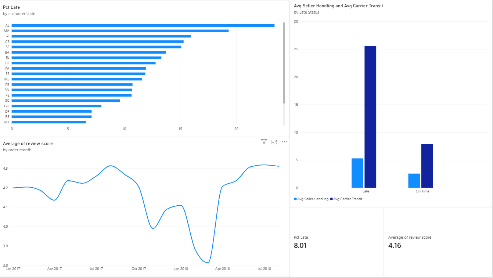

# What's actually driving bad reviews at Olist?

I picked this dataset up as my first real data analysis project, coming from
a data engineering background. The goal wasn't just to poke around and make
some charts — I wanted to answer one specific business question the way an
analyst would, end to end: SQL → stats → dashboard → a recommendation someone
could actually act on.

## The question

**Why do customers leave bad reviews, and what should Olist do about it?**

I picked this over a dozen other things I could've looked at in this dataset
because it has a clear, single answer that leads somewhere — not just "here
are some interesting numbers."

## How I approached it

Coming from DE, my first instinct was to build a pipeline and clean
everything. I made myself not do that. No Airflow, no dbt, no orchestration —
just Postgres, one load script, and SQL views that only clean what the
question actually needs. The mental shift I was practicing here: stop asking
"is this data correct and complete," start asking "does this change what
someone should do next."

Stack: PostgreSQL for the querying and cleaning, Python (pandas/scipy) to
check whether what I was seeing was statistically real or just noise, Power
BI for the dashboard.

## What I found

**Late delivery is the big one.** It's not a minor factor among several —
it's the story.

| | On-time orders | Late orders |
|---|---|---|
| Avg review score | 4.29 / 5 | 2.57 / 5 |
| % bad reviews (1–2 stars) | 9.2% | 54.1% |
| n orders | 87,902 | 7,658 |

I didn't want to just eyeball that gap and call it a day, so I ran a Welch's
t-test on it: t = -89.42, p < 0.001. That's about as far from "coincidence"
as a result gets. Correlation between how many days late an order was and
its score: r = -0.27.

It's also not all-or-nothing — a couple days late barely moves the needle,
but it gets ugly fast after that:

| Delay bucket | Avg review score |
|---|---|
| On time | 4.29 |
| Late 1–3 days | 3.77 |
| Late 4–7 days | 2.32 |
| Late 8+ days | 1.73 |

**The part I actually think is the interesting finding:** I split the delay
into two stages — how long the seller took to hand the order to the carrier,
vs. how long the carrier took to actually deliver it. On late orders, seller
handling time roughly doubles (2.55 → 5.28 days), but carrier transit time
more than triples (7.89 → 25.57 days). So when people say "Olist deliveries
are late," the bigger culprit is the carrier leg, not sellers dragging their
feet. That's a very different fix than "email sellers to ship faster."

**Geography backs this up.** The states with the worst late rates —
Alagoas, Maranhão, Piauí, Ceará, Sergipe, all 15–23% late — are all up in
the North/Northeast, far from where most sellers are based (Southeast
Brazil). Makes sense if the bottleneck is transit distance, not seller
behavior.

**It also isn't a constant problem.** Late rate spikes hard in Nov 2017
(14.1%, I'm guessing Black Friday volume) and again Feb–Mar 2018 (up to
21.1%), then basically disappears by mid-2018. So this reads more like a
capacity problem during specific high-volume windows than a chronic issue.

## What I'd tell Olist to do

Fix carrier transit time, not seller handling — and prioritize it in the
Northeast during high-volume periods (looks like Nov and Feb–Mar). That's
where the data says the leverage actually is.

## The dashboard

Built in Power BI, connected straight to the Postgres views below. Four
visuals: the two headline KPIs (avg score, % late), a monthly trend line, a
worst-states bar chart (filtered to states with 100+ orders so a handful of
outlier orders in a tiny state can't skew it), and the seller-vs-carrier
breakdown chart, which is honestly the one that makes the whole point at a
glance.



## Repo structure

```
sql/
  01_load.sql            raw load, no cleaning, no constraints
  02_explore.sql          just looking — row counts, nulls, date ranges
  03_prepare.sql           the cleaning decisions, as views
  04_analysis.sql          the actual analysis, layered top to bottom
  05_dashboard_view.sql    the view Power BI reads from
python/
  analysis.py              the significance test + a quick set of charts
charts/
  (the 5 PNGs analysis.py produces)
```

## A few data quirks worth knowing about if you dig into this

- Orders can have multiple `order_items` rows (about 10% do) — had to
  aggregate to order level before joining anything, or revenue gets
  multiplied.
- A handful of orders got reviewed twice (looks like a resubmitted answer)
  — kept whichever review came last.
- 2016 barely has any orders in it, so I cut it from anything time-based.
- Category lives at the item level, not the order level, since one order
  can span categories — so the category breakdown is its own separate
  query rather than bolted onto everything else.

## Why I built it this way

This was as much about practicing the analyst mindset as it was about the
actual findings — SQL for the querying, a real significance test instead of
"the averages look different," a dashboard someone could actually open and
use, and a recommendation written in plain language instead of a wall of
numbers. That's the combination I was told matters most for this kind of
role, so that's what I optimized for here.
